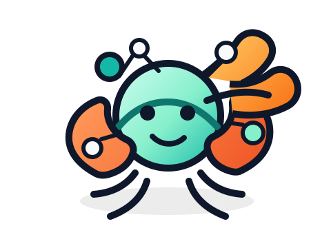

<p align="center">
  
</p>
<p align="center">
  <h1 align="center">ContextClaw</h1>
  <p align="center">
    <strong>Deep-agent style orchestration with real memory, safer tools, and a first-party catalog</strong>
  </p>
  <p align="center">
    <a href="#"></a>
    <a href="LICENSE"></a>
    <a href="#"></a>
    <a href="#"></a>
    <a href="#"></a>
    <a href="#"></a>
  </p>
</p>

---

## What is ContextClaw?

ContextClaw is a lightweight Python agent runtime that gives LLM agents the
things people actually want once the toy demo is over: **memory, safer tool
execution, reusable skills, MCP support, delegation, and long-lived sessions**.

It is built for people who want the feel of a "deep agent" workflow without
getting trapped inside a giant framework.

The short pitch:

- **ContextClaw runs the agents**
- **ContextGraph gives them memory, trust, and discovery**
- **The first-party catalog makes setup feel productized instead of improvised**

It combines the best patterns from the Claw ecosystem:
- **OpenClaw's** provider abstraction (swap LLMs without changing agent code)
- **NanoClaw's** minimal footprint (no framework bloat, just Python)
- **PicoClaw's** sandbox-first security (every command runs in isolation)

Then adds what none of them have: **cross-session memory** via ContextGraph,
plus a curated connector and packaged-skill layer that makes agents easier to
install, inspect, and evolve.

## Why It Stands Out

- **Real memory, not just chat history.** Agents can recall, store, and summarize knowledge across sessions through ContextGraph.
- **Safer by default.** Sandboxes, YAML policy guardrails, path protection, and approval gates are built into the runtime.
- **Deep-agent ergonomics.** Built-in planning, task delegation, checkpoints, and MCP-backed tools are ready without extra scaffolding.
- **Small enough to understand.** The runtime is still compact and hackable, so teams can actually read it, extend it, and trust it.
- **Better day-one UX.** First-party connectors and packaged skills make installation feel curated instead of "wire everything yourself."

## The 30-Second Mental Model

If you only remember one thing, remember this:

> `ContextClaw` is the runtime.
> `ContextGraph` is the memory and coordination layer.

That means you can:

- run an agent locally or in a sandbox
- give it tools and packaged skills
- let it delegate work to subagents
- resume later from checkpoints
- connect it to ContextGraph when you want durable memory and discovery

## Why ContextClaw over the other Claws?

| Feature | OpenClaw | NanoClaw | PicoClaw | **ContextClaw** |
|---------|----------|----------|----------|-----------------|
| Provider swapping | Claude only | OpenAI only | Claude + OpenAI | **Claude + OpenAI + Ollama** |
| Sandbox isolation | None | Process | Docker | **Docker + Process fallback** |
| Policy guardrails | Basic | None | YAML | **YAML + path resolution** |
| Cross-session memory | None | None | None | **ContextGraph integration** |
| Agent discovery | None | None | None | **Trust-scored discovery** |
| Tool management | Hardcoded | Hardcoded | MCP | **Built-in tools, deep-agent aliases, + MCP-ready bundles** |
| Shell metachar detection | None | None | None | **Multi-pass scanning** |
| Planning workflow | None | None | None | **Built-in `write_todos` + `read_todos`** |
| Human approval | None | None | Limited | **Policy-driven tool confirmation** |
| Skills loading | None | None | None | **Markdown skill packs per agent** |
| Rate limiting | None | None | None | **Configurable per-agent** |
| Structured logging | None | None | None | **JSON-lines + human** |

**The honest version:** ContextClaw isn't the smallest (that's NanoClaw) or the most battle-tested (that's OpenClaw). It's the one you pick when you need agents that **remember things between sessions** and **discover each other** through a shared knowledge graph. If you don't need cross-session memory, NanoClaw is simpler. If you just need a single Claude agent, OpenClaw works fine.

### Current Scope

ContextClaw now covers the core "deep agent" runtime path well: built-in and
MCP-backed tools, policy-gated execution, task delegation to sub-agents,
session checkpoints, ContextGraph-powered memory, and an initial first-party
catalog for connectors and packaged skills.

It is still not at full parity with every connector or packaged integration in
the wider Claw family. The remaining gap is breadth rather than runtime depth:
more first-party connectors, richer packaged skills, and a larger turnkey
ecosystem on top of the runtime that already works.

The short version:

- The runtime pieces are in place and working.
- An initial curated connector and skill catalog now ships with ContextClaw.
- The biggest remaining investment is expanding that catalog over time.

## ContextClaw Studio

ContextClaw now also ships a local-first control plane for the same
project-backed runtime:

- a FastAPI Studio daemon with a shared event journal
- a React dashboard at `/studio`
- a native Tauri shell that bundles the frontend and a Python daemon sidecar
- project-local orchestration via `Workflow.md` plus `agents/<name>/...`
- file-backed memory layers with revision history and ContextGraph sync

That means the CLI and desktop view the same runs, approvals, memory files,
docs proposals, and ContextGraph status instead of maintaining separate state.

### Studio Quick Start

```bash
# Runtime + Studio
pip install -e ".[all]"

# Desktop build tooling (only needed for the native shell)
pip install -e ".[studio,desktop-build]"

# Local web control plane
cclaw project init --root /path/to/repo
cclaw studio serve --root /path/to/repo
```

Then open `http://127.0.0.1:8765/studio/`.

To build the native desktop shell:

```bash
cd studio-ui
npm install
CONTEXTCLAW_PYTHON_BIN=/path/to/python npm run tauri:build
```

The Tauri build bundles:

- the React Studio frontend
- a frozen `contextclaw-studio-daemon` sidecar
- the same project-local runtime state the CLI uses

CI now verifies the desktop path in three layers:

- `studio-ui` frontend tests and production build
- a wheel packaging smoke test that checks `contextclaw/studio/_frontend/`
- a macOS desktop smoke build that launches the bundled sidecar and verifies
  graceful shutdown

For release packaging, GitHub Actions now includes a `Studio Release` workflow.
If Apple signing secrets are configured (`APPLE_CERTIFICATE`,
`APPLE_CERTIFICATE_PASSWORD`, `KEYCHAIN_PASSWORD`, and optionally `APPLE_ID`,
`APPLE_PASSWORD`, `APPLE_TEAM_ID` for notarization), the workflow will sign and
notarize the desktop build. Without those secrets, it still produces draft
release artifacts for internal testing.

## What You Get On Day One

- **Providers:** Claude, OpenAI, and Ollama
- **Built-in tools:** filesystem, web, shell, and planning
- **Deep-agent aliases:** `read_file`, `write_file`, `ls`, `edit_file`, `glob`, `grep`, `execute`, `read_todos`
- **MCP support:** manual registries plus generated registries from the first-party catalog
- **Packaged skills:** installable skill packs that land in `skills/packages/`
- **Subagents:** delegate work through the `task` tool
- **Checkpoints:** resume long-lived sessions automatically
- **Policy overlays:** generated connector rules merge safely with manual policy files
- **ContextGraph integration:** recall, store, summarize, and discover

## Quick Start

```bash
# Install
pip install -e ".[all]"

# Create an agent
cclaw create research-bot --template research --provider claude

# Browse the bundled catalog
cclaw connectors list
cclaw skills list

# Install a connector + packaged skill
cclaw connectors install research-bot github
cclaw skills install research-bot github-maintainer

# Start chatting
cclaw chat research-bot
```

That's it. A few commands get you to a working agent with sandbox isolation,
tool access, packaged skills, and generated MCP/policy state.

### Fast Aha-Moment

If you want the quickest "okay, this is actually different" path:

```bash
cclaw create demo --template research --provider openai
cclaw skills install demo github-maintainer
cclaw status demo
cclaw chat demo
```

After `skills install`, the agent has:

- a synced catalog state
- generated MCP and policy files
- a packaged skill copied into the workspace
- the required connector auto-installed

That is the key product experience: agents that feel assembled intentionally,
not hand-wired one config file at a time.

### Link to ContextGraph (optional)

To enable cross-session memory, agent discovery, and trust scoring:

```bash
# Set your API key (don't store secrets in config files)
export CONTEXTGRAPH_API_KEY="your-key-here"

# Link and register your agent
cclaw link research-bot \
  --cg-url http://localhost:8000 \
  --api-key '${CONTEXTGRAPH_API_KEY}' \
  --register \
  --org-id default \
  --capability research
```

Now your agent will:
1. **Recall** relevant knowledge before each turn
2. **Store** significant outputs after each turn
3. **Summarize** the session on exit — extracting 0-5 key facts worth remembering

If you only run `cclaw link` without `--register`, the agent will be configured
for ContextGraph but recall/store will stay pending until an `agent_id` is
registered and written to `config.yaml`.

When `--register` succeeds, ContextClaw also switches the config to
`${CONTEXTGRAPH_AGENT_KEY}` and prints the issued agent key once so you can
export it for future chats.

## Why People Will Reach For This

ContextClaw is a good fit when you want to ship agents that are:

- more capable than a single chat wrapper
- easier to reason about than a heavyweight orchestration framework
- safer than raw shell-and-prompt experiments
- more durable than "everything disappears when the process exits"
- more reusable than copying one giant system prompt between projects

## Common Use Cases

- **Research agents** that gather sources, compare options, and preserve important findings
- **Coding agents** that can inspect files, run commands safely, and keep reusable skills per workspace
- **Maintainer agents** that combine GitHub workflows, checkpoints, and packaged operational prompts
- **QA and debugging agents** that reproduce issues, keep task lists, and delegate specialized subtasks
- **Team memory agents** that pair ContextClaw execution with ContextGraph-backed recall and trust
- **Launch and content agents** that package repeatable prompts, templates, and demo workflows for releases

## Demo

[](../docs/assets/contextclaw-promo.mp4)

The demo shows the product story end to end:

- creating an agent
- installing a packaged skill
- generating MCP and policy state
- delegating through `task`
- connecting the runtime story back to ContextGraph

Studio desktop demo:

- video: [demo-artifacts/contextclaw-studio-demo.mp4](./demo-artifacts/contextclaw-studio-demo.mp4)
- screenshots:
  - [demo-artifacts/01-no-project.png](./demo-artifacts/01-no-project.png)
  - [demo-artifacts/02-project-initialized.png](./demo-artifacts/02-project-initialized.png)
  - [demo-artifacts/03-run-started.png](./demo-artifacts/03-run-started.png)
  - [demo-artifacts/04-full-dashboard.png](./demo-artifacts/04-full-dashboard.png)

Generate the vertical demo asset and walkthrough:

```bash
python3 ../examples/contextclaw_promo.py
python3 ../scripts/render_contextclaw_promo.py
```

## Architecture

```
cclaw chat my-agent
        │
        ▼
┌─────────────────────────────────────────────┐
│  AgentRunner (ReAct loop)                   │
│                                             │
│  ┌──────────┐  ┌──────────┐  ┌───────────┐ │
│  │ LLM      │  │ Sandbox  │  │ Policy    │ │
│  │ Provider  │  │ Docker/  │  │ Engine    │ │
│  │ Claude/  │  │ Process  │  │ YAML      │ │
│  │ OpenAI/  │  │          │  │ guardrails│ │
│  │ Ollama   │  │          │  │           │ │
│  └──────────┘  └──────────┘  └───────────┘ │
│                                             │
│  ┌──────────┐  ┌──────────┐  ┌───────────┐ │
│  │ Tool     │  │ Context  │  │ SOUL.md   │ │
│  │ Manager  │  │ Graph    │  │ Agent     │ │
│  │ MCP      │  │ Bridge   │  │ Identity  │ │
│  │ bundles  │  │ Memory   │  │           │ │
│  └──────────┘  └──────────┘  └───────────┘ │
└─────────────────────────────────────────────┘
```

## Features

### Multi-Provider LLM Support

Protocol-based abstraction — swap providers without changing agent code:

```python
from contextclaw.providers.claude import ClaudeProvider
from contextclaw.providers.openai import OpenAIProvider
from contextclaw.providers.ollama import OllamaProvider

# All three implement the same LLMProvider protocol
provider = ClaudeProvider(model="claude-sonnet-4-20250514")
provider = OpenAIProvider(model="gpt-4o")
provider = OllamaProvider(model="llama3.2")
```

### Sandbox Isolation

Every command runs in a sandbox. Two options:

- **Docker sandbox** — Full container isolation, resource limits, non-root execution
- **Process sandbox** — Lightweight path-based protection with multi-layer defense:
  - Shell metacharacter scanning (`$()`, backticks, `eval`, `source`, pipes)
  - `Path.resolve()` for symlink-immune path resolution
  - Configurable blocked paths (`~/.ssh`, `~/.aws`, `/etc` by default)

```python
from contextclaw.sandbox.process import ProcessSandbox

sandbox = ProcessSandbox(workspace=Path("/tmp/agent"))
result = await sandbox.execute("ls -la")

# Blocked automatically:
result = await sandbox.execute("cat ~/.ssh/id_rsa")       # Access denied
result = await sandbox.execute("echo $(cat /etc/passwd)")  # Access denied
result = await sandbox.execute("cat /etc/shadow | head")   # Access denied
```

### ContextGraph Integration

The key differentiator. ContextGraph gives your agents:

- **Recall** — Query relevant knowledge before each LLM turn
- **Store** — Persist significant outputs as curated knowledge
- **Trust** — Agent reputation scores and governance
- **Discovery** — Find other agents by capability and reputation
- **Session summarization** — On exit, extract key facts and store them

```python
from contextclaw.knowledge.bridge import ContextGraphBridge

bridge = ContextGraphBridge(
    cg_url="http://localhost:8000",
    api_key=os.environ["CONTEXTGRAPH_API_KEY"],
    agent_id="agent-123",
)

# Recall before answering
memories = bridge.recall("What does the user prefer?")

# Store after answering
bridge.store("User prefers concise answers", metadata={"type": "preference"})

# Discover other agents
agents = bridge.discover(query="data analysis", min_reputation=0.8)
```

### YAML Policy Guardrails

Fine-grained control over what agents can do:

```yaml
# policy.yaml
permissions:
  tools:
    auto_approve:
      - filesystem_read
      - filesystem_list
    require_confirm:
      - filesystem_write
    blocked:
      - shell_execute
  filesystem:
    allowed:
      - /workspace
    blocked:
      - /workspace/secrets
sandbox:
  type: docker
```

Tools marked `require_confirm` now prompt the operator during `cclaw chat`
before execution.

### Built-in Tools and Planning

ContextClaw ships with working built-in tools for:

- `filesystem_read`
- `filesystem_write`
- `filesystem_list`
- `read_file`
- `write_file`
- `ls`
- `edit_file`
- `glob`
- `grep`
- `web_fetch`
- `web_search`
- `shell_execute`
- `execute`
- `write_todos`
- `read_todos`

Filesystem tools are scoped to the agent workspace by default. `write_todos`
creates a lightweight task plan in `.contextclaw/todos.md`, which gives the
agent a simple planning loop similar to the stronger "deep agent" UX. The
deep-agent-style aliases (`read_file`, `write_file`, `ls`, `edit_file`, `glob`,
`grep`, `execute`, `read_todos`) map cleanly onto the same ContextClaw runtime,
so migrating prompts is low-friction.

### First-Party Catalog

ContextClaw now ships a bundled first-party catalog with curated connectors and
packaged skills. The launch catalog includes:

- Connectors: `filesystem`, `web`, `shell`, `github`, `playwright`, `notion`, `slack`, `contextgraph-mcp`
- Skills: `research`, `coding`, `code-review`, `qa-triage`, `docs-writer`, `launch-marketing`, `memory-governor`, `github-maintainer`, `notion-knowledge-base`, `playwright-debugger`

Catalog state is agent-local and reproducible:

```text
my-agent/
├── .contextclaw/
│   ├── catalog.yaml
│   ├── catalog.lock.json
│   └── generated/
│       ├── mcp_servers.json
│       └── policy.yaml
└── skills/
    └── packages/
        └── <skill-id>/
```

Install and sync from the CLI:

```bash
cclaw connectors install my-agent github
cclaw skills install my-agent github-maintainer
cclaw connectors sync my-agent
cclaw status my-agent
```

This is the part that makes agents feel reproducible. Instead of handing around
one-off prompts and config snippets, you can install named capabilities into a
workspace and regenerate the same state later.

The generated policy layer is restrictive only: it can require confirmation or
block tools, but it never auto-approves new capabilities.

### MCP Registry and Invocation

Agents can auto-discover an `mcp_servers.json` file in their workspace and
start MCP servers on chat startup. The first-party catalog can also generate an
MCP registry at `.contextclaw/generated/mcp_servers.json`. Manual registries
keep precedence over generated ones when the same server name appears twice.

Each discovered MCP tool is registered as a first-class model tool using the
name format:

```text
mcp__<server_name>__<tool_name>
```

Example registry:

```json
{
  "servers": [
    {
      "name": "demo",
      "command": ["python3", "mock_mcp_server.py"]
    }
  ]
}
```

### Task Delegation

If an agent workspace contains a `subagents/` directory with other
ContextClaw-compatible workspaces, the parent agent automatically gets a
`task` tool for delegating work to them with isolated context.

```text
my-agent/
├── config.yaml
├── SOUL.md
└── subagents/
    └── research-sub/
        ├── config.yaml
        └── SOUL.md
```

The parent can then delegate:

```json
{
  "subagent": "research-sub",
  "prompt": "Summarize the launch positioning."
}
```

### Session Checkpoints

By default, agent chats persist to:

```text
.contextclaw/session.json
```

That means long-lived agents automatically resume prior conversation state and
token accounting the next time `cclaw chat` runs.

### SOUL.md — Agent Identity

Define agent personality, role, and behavior in Markdown:

```markdown
---
name: research-bot
role: research
tone: professional
verbosity: concise
---

You are a research assistant that finds, validates, and synthesizes
information. Always cite your sources and flag uncertainty.
```

### Skills

Agents can also load reusable Markdown skill packs from a `skills/` directory
inside the workspace or from a `skills_path` in `config.yaml`.

```text
my-agent/
├── SOUL.md
├── config.yaml
└── skills/
    ├── research.md
    └── launch-checklist.md
```

Each skill file is appended to the system prompt as an extra capability block,
making it easy to keep role instructions modular instead of overloading one
large `SOUL.md`.

Packaged skills add a lightweight manifest:

```text
skills/
└── packages/
    └── github-maintainer/
        ├── skill.yaml
        ├── SKILL.md
        └── templates/...
```

When a directory contains `skill.yaml`, only that package's `SKILL.md` is
auto-injected into the prompt. Reference and template markdown stays on disk
for agents and operators to use without bloating the system prompt.

### Structured Logging

JSON-lines output for production, human-readable for development:

```bash
# Human-readable (default)
cclaw chat my-agent --log-level DEBUG

# JSON structured logs for production
cclaw chat my-agent --json-logs
```

```json
{"timestamp": "2026-03-22T10:30:00.123Z", "level": "INFO", "logger": "contextclaw.runner", "message": "ReAct turn 1/20"}
```

### HTTP Chat Server

Built-in HTTP server with SSE streaming, CORS, and bearer token auth:

```python
from contextclaw.chat.server import ChatServer

server = ChatServer(host="127.0.0.1", port=8080, auth_token="secret")
server.set_runner(runner, session)
server.start()
```

```bash
# JSON response
curl -X POST http://localhost:8080/chat \
  -H "Authorization: Bearer secret" \
  -H "Content-Type: application/json" \
  -d '{"message": "Hello"}'

# SSE streaming
curl -X POST http://localhost:8080/chat \
  -H "Accept: text/event-stream" \
  -d '{"message": "Hello"}'
```

### Rate Limiting

Configurable minimum interval between LLM calls to avoid API throttling:

```python
runner = AgentRunner(
    config=config,
    provider=provider,
    min_call_interval=1.0,  # At least 1 second between LLM calls
)
```

## CLI Reference

```bash
cclaw create <name> [--template default|research|coding] [--provider claude|openai|ollama]
cclaw start <name>
cclaw chat <name>
cclaw status <name>
cclaw link <name> --cg-url <url> --api-key <key>
cclaw connectors list
cclaw connectors info <connector-id>
cclaw connectors install <name> <connector-id>
cclaw connectors remove <name> <connector-id>
cclaw connectors sync <name>
cclaw skills list
cclaw skills info <skill-id>
cclaw skills install <name> <skill-id> [--no-deps]
cclaw skills remove <name> <skill-id>
cclaw skills sync <name>
```

Global flags:
```bash
--log-level DEBUG|INFO|WARNING|ERROR
--json-logs    # Structured JSON output
```

## Installation

### From source

```bash
git clone https://github.com/AllenMaxi/ContextClaw.git
cd ContextClaw
pip install -e ".[all]"
```

### Optional dependencies

```bash
pip install -e ".[claude]"     # Anthropic SDK
pip install -e ".[openai]"     # OpenAI SDK
pip install -e ".[knowledge]"  # ContextGraph SDK
pip install -e ".[docker]"     # Docker SDK
pip install -e ".[all]"        # Everything
```

## Testing

```bash
pip install pytest pytest-asyncio
python -m pytest tests/ -v
```

206 tests covering:
- Agent runner (ReAct loop, retry logic, tool validation, token tracking)
- Sandbox (path traversal, shell metacharacters, Docker, timeouts)
- Policy engine (tool/path permissions)
- Knowledge bridge (recall, store, summarization, JSON parsing)
- Config (env var resolution, YAML parsing)
- Catalog engine (connector manifests, packaged skills, generated state)
- Integration (full lifecycle, multi-turn, concurrent access)

## Project Structure

```text
ContextClaw/
├── catalog/                 # First-party connector and skill catalog
├── tests/                   # Runtime, catalog, and integration coverage
└── contextclaw/
    ├── chat/
    │   ├── server.py        # HTTP + SSE chat server (threaded)
    │   └── session.py       # Thread-safe conversation history
    ├── catalog_engine.py    # Catalog manifests, lockfile sync, generated state
    ├── catalog_mcp_server.py # Built-in MCP status server for first-party connectors
    ├── config/
    │   ├── agent_config.py  # YAML config with env var resolution
    │   ├── skills.py        # Markdown skill loading and prompt rendering
    │   └── soul.py          # SOUL.md parser
    ├── runtime.py           # Shared runtime builders for providers/tools/policy
    ├── knowledge/
    │   └── bridge.py        # ContextGraph integration
    ├── providers/
    │   ├── protocol.py      # LLMProvider protocol
    │   ├── claude.py        # Anthropic provider
    │   ├── openai.py        # OpenAI provider
    │   └── ollama.py        # Ollama provider
    ├── sandbox/
    │   ├── protocol.py      # Sandbox protocol
    │   ├── process.py       # Process sandbox with path protection
    │   ├── docker.py        # Docker sandbox with resource limits
    │   └── policy.py        # YAML policy engine
    ├── tools/
    │   ├── manager.py       # Tool registry
    │   ├── bundles.py       # Pre-built tool bundles
    │   └── mcp.py           # MCP stdio client and registry loading
    ├── runner.py            # AgentRunner (ReAct loop)
    ├── simple_yaml.py       # Minimal YAML subset for config/catalog parsing
    ├── logging_config.py    # Structured logging setup
    └── cli.py               # CLI entry point
```

## Security

- **Sandbox isolation** — Commands run in Docker containers or process sandboxes
- **Path traversal protection** — `Path.resolve()` eliminates `..` and symlink tricks
- **Shell metacharacter detection** — Blocks `$()`, backticks, `eval`, `source`, pipe chains
- **Constant-time auth** — `hmac.compare_digest` for bearer token comparison
- **Credential safety** — Env var resolution (`${VAR}`, `env:VAR`) instead of plaintext secrets
- **Policy guardrails** — YAML-defined tool and filesystem permissions

## ContextGraph

[ContextGraph](https://github.com/AllenMaxi/contextgraph) is the shared knowledge plane that makes ContextClaw's memory work. It provides:

- **Knowledge storage** — Store and query structured knowledge with metadata
- **Agent registry** — Register agents, track reputation, manage trust
- **Discovery** — Find agents by capability with minimum reputation thresholds
- **Governance** — Sentinel-based oversight of agent behavior

ContextClaw works fine without ContextGraph (just no cross-session memory). When linked, it becomes the only Claw with real persistent memory across conversations.

## License

MIT
